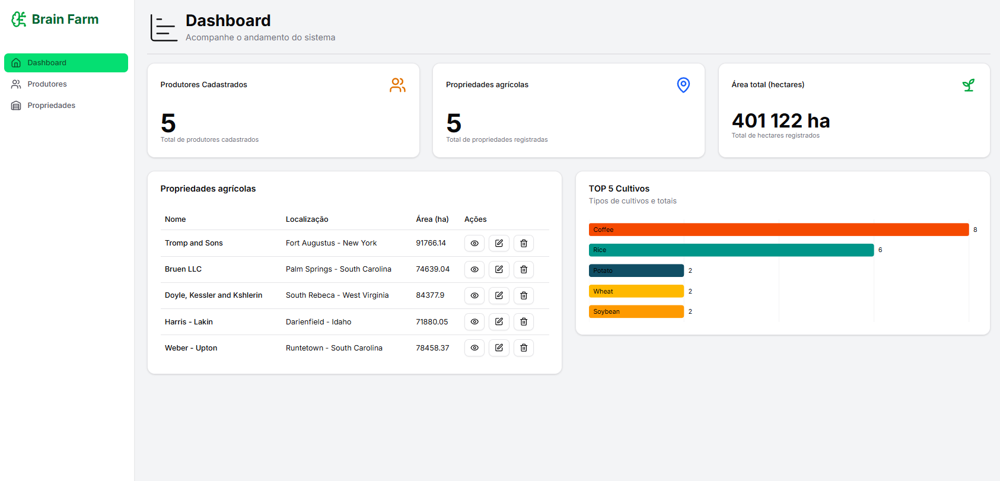

# Brain Farm

Este projeto é um sistema de gestão agrícola que permite organizar dados sobre os produtores, registrar informações das propriedades rurais, padronizar os tipos de culturas e acompanhar cada etapa do ciclo produtivo das colheitas, desde o plantio até a colheita, promovendo uma gestão mais eficiente e estruturada da produção.



## Sumário
- [Requisitos](#requisitos)
- [Tecnologias](#tecnologias)
- [Estrutura do Projeto](#estrutura-do-projeto)
- [Configuração do Ambiente](#configuração-do-ambiente)
- [Utilizando Docker](#utilizando-docker)
- [Rodando o Projeto](#rodando-o-projeto)
  - [Bran Farm Client](#frontend)
  - [Bran Farm Server](#backend)

---

## Requisitos

- Node.js >= 20.x
- [pnpm](https://pnpm.io/) >= 9.x
- Docker (opcional, recomendado para banco de dados)

## Tecnologias

- **Backend**: [NestJS](https://nestjs.com/) | [TypeORM](https://typeorm.io/) | [PostgreSQL](https://www.postgresql.org/) | [Jest](https://jestjs.io/pt-BR/) | [Swagger](https://swagger.io/)
- **Frontend**: [NextJS](https://nextjs.org/) | [Shadcn/UI](https://ui.shadcn.com/) | [React Query](https://tanstack.com/query/latest/docs/framework/react/overview)
- [Docker & Docker Compose](https://www.docker.com/)

## Estrutura do Projeto

- `apps/server`: Brain Farm - Backend (📃 [Documentação](./apps/server/README.md))
- `apps/client`: Brain Farm - Frontend (📃 [Documentação](./apps/client/README.md))

## Configuração do Ambiente

1. Copie o arquivo `.env.example` para `.env` e configure as variáveis de ambiente necessárias. 

2. Instalando todas as dependências do projeto (PNPM Workspace):

```sh
pnpm install
```

## Utilizando Docker
O projeto inclui um arquivo `docker-compose.yaml` para facilitar o uso do banco PostgreSQL.

### Subir o banco de dados

```sh
docker-compose up -d
```
Certifique-se de que a variável `DATABASE_URL` no `.env` está apontando para o banco do Docker.

## Rodando o Projeto

> [!TIP]
> Todos os comandos podem ser rodados na pasta raiz, seguindo os scripts do `package.json`

### Desenvolvimento
Lembre-se de estar com o banco de dados rodando. Veja em: [Utilizando Docker](#utilizando-docker)

#### Executando o backend

```sh
pnpm server:dev
```

Todas `migrations` necessárias serão adicionadas ao banco de dados, e a aplicação estará disponível na porta definida em `PORT` (https://localhost:3000/v1/) .

#### Executando frontend

```sh
pnpm client:dev
```
A aplicação rodará na porta 3001 (https://localhost:3001/)

## Scripts de Banco de Dados

O projeto utiliza TypeORM para gerenciamento de migrations.

### Executa e aplica todas as migration pendentes

```sh
pnpm server:database
```
## Pontos de melhoria

### BACKEND
- Implementar Authentication e Authorization ( [Keycloak](http://keycloak.org/) | [Auth0](https://auth0.com/) | SSO );
- Implementar `camada de cache` para os recursos do sistema ( [Redis](https://redis.io/) | [NestJS Caching](https://docs.nestjs.com/techniques/caching) );
- Implementar regras de negócios às entidades;
- Melhoria da documentação da aplicação em `Swagger`;
- Proteger o endpoint da documentação em produção;

### FRONTEND
- Implementar `Authentication` e `Authorization` ( [Keycloak](http://keycloak.org/) | [Auth0](https://auth0.com/) | [Auth.js (NextAuth.js)](https://authjs.dev/) );
- Implementar controlo de estado global ( [Zustand](https://zustand-demo.pmnd.rs/) | [Redux](https://redux.js.org/) | [Immer](https://immerjs.github.io/immer/) ) 
- Criar testes em componentes ( [React Testing LIbrary](https://testing-library.com/) | [Playwright](https://playwright.dev/) );
- Criar componentes genéricos para uso geral do sistema ( Header, DataTable, Pagination, Modal, Alerts )
- Padronização de toda a interface e componentes ( Cores, Tamanhos e Ícones )

---

## Contato
**Gabriel Januario Duarte de Souza**<br/>
jds.gabrielduarte@gmail.com - [LinkedIn](https://www.linkedin.com/in/jdsgabriel/) 