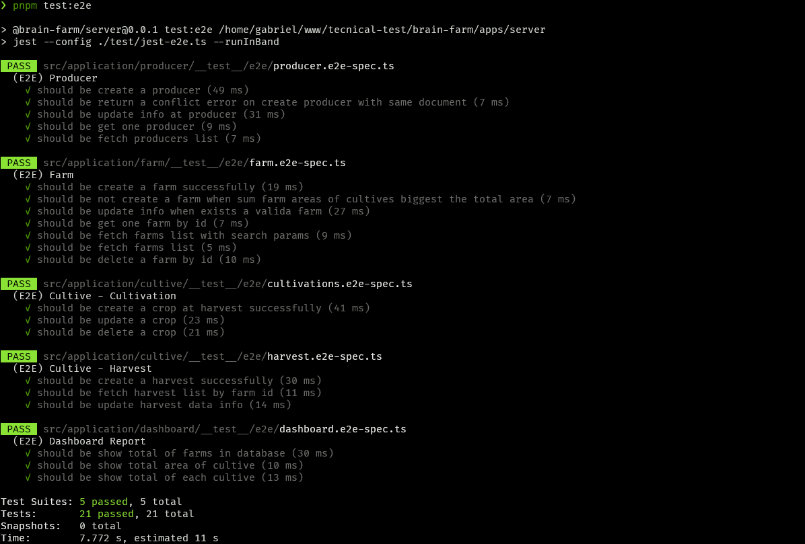

# Brain Farm - Server

Este projeto é uma API construída com [NestJS](https://nestjs.com/) para gerencia Fazendas, produtores e produção agrícola.

## Sumário
- [Tecnologias](#tecnologias)
- [Estrutura do Projeto](#estrutura-do-projeto)
- [Scripts de Banco de Dados](#scripts-de-banco-de-dados)
- [Testes](#testes)
- [Documentação da API](#documentação-da-api)
- [Pontos de melhoria](#pontos-de-melhoria)
---

## Tecnologias
- [NestJS](https://nestjs.com/)
- [TypeORM](https://typeorm.io/)
- [PostgreSQL](https://www.postgresql.org/)
- [Jest](https://jestjs.io/pt-BR/)
- [Swagger](https://swagger.io/)

## Estrutura do Projeto

- `src/application`: Módulos da aplicação;
- `src/application/dashboard`: Módulo provedor de informações gerais;
- `src/application/cultive`: Módulo para gerenciar o cultivo;
- `src/application/producer`: Módulo para gerenciar a propriedade agrícola;
- `src/application/farm`: Módulo para gerenciar o cadastro do produtor;
- `src/shared`: Módulos e utilitários compartilhados;
- `test`: Scripts e utilitários para configuração e execução dos testes;

## Rodando o Projeto (Backend)

### Desenvolvimento
Lembre-se de estar com o banco de dados rodando. Veja em: [Utilizando Docker](#utilizando-docker)
```sh
pnpm start:dev
```
Todas `migrations` necessárias serão adicionadas ao banco de dados, e a aplicação estará disponível na porta definida em `PORT` (padrão: 3000).

## Scripts de Banco de Dados

O projeto utiliza TypeORM para gerenciamento de migrations.

### Gerar uma nova migration.

```sh
pnpm db:generate
```

### Executar migrations no banco de dados.

```sh
pnpm db:run
```
### Primeira execução
### Executar todas as migrations pendentes e iniciar banco de dados.

```sh
pnpm db:deploy
```

## Testes

### Testes end-to-end

```sh
pnpm test:e2e
```



## Documentação da API

Após rodar o projeto, acesse a documentação `Swagger` em:

```
http://localhost:3000/docs
```
## Pontos de melhoria
- Implementar Authentication e Authorization ( [Keycloak](http://keycloak.org/) | [Auth0](https://auth0.com/) | SSO );
- Implementar `camada de cache` para os recursos do sistema ( [Redis](https://redis.io/) | [NestJS Caching](https://docs.nestjs.com/techniques/caching) );
- Implementar regras de negócios às entidades;
- Melhoria da documentação da aplicação em `Swagger`;
- Proteger o endpoint da documentação em produção;
---
